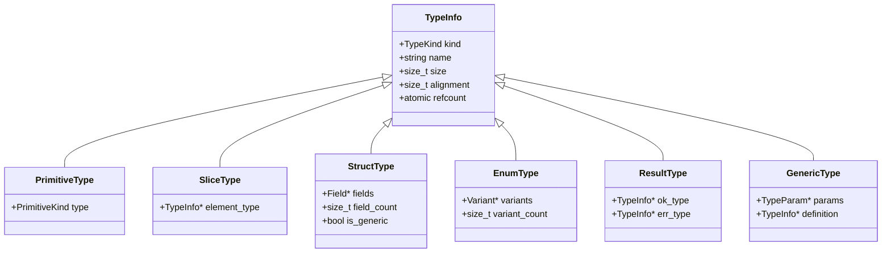

# Asthra Compiler Architecture Diagrams

This document provides visual representations of the Asthra compiler architecture using Mermaid diagrams.

## Overall Compilation Pipeline

## Detailed Component Architecture

## Memory Management Architecture

## Type System Architecture

## Code Generation Flow

## Build System Architecture

## Concurrency Architecture

## Error Handling Flow

## Extension Points

## Data Flow Through Compilation

## Summary

These diagrams illustrate:
- **Pipeline Flow**: How source code transforms into executables
- **Component Architecture**: Internal structure of major modules
- **Memory Management**: Reference counting and allocation strategies
- **Type System**: Hierarchical type representation
- **Build System**: Modular Makefile organization
- **Concurrency**: Parallel compilation and runtime support
- **Error Handling**: Recovery and reporting mechanisms
- **Extension Points**: Where to add new features
- **Data Flow**: Step-by-step compilation process

The visual representations help understand the relationships between components and the flow of data through the compilation pipeline.