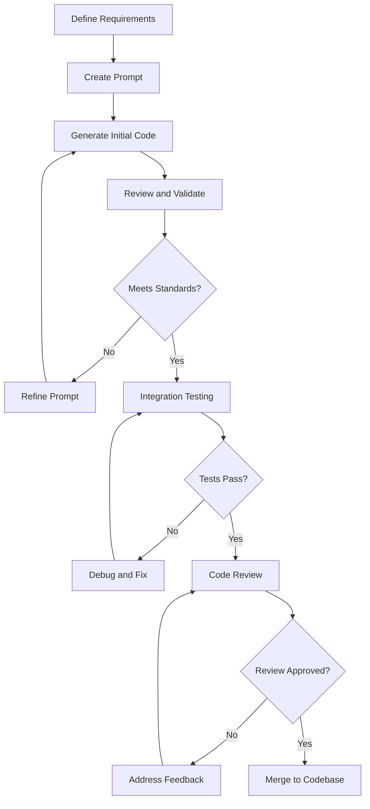
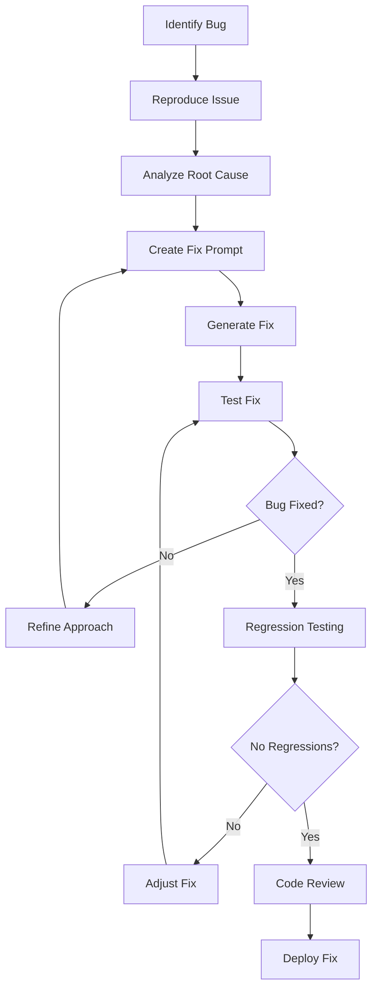
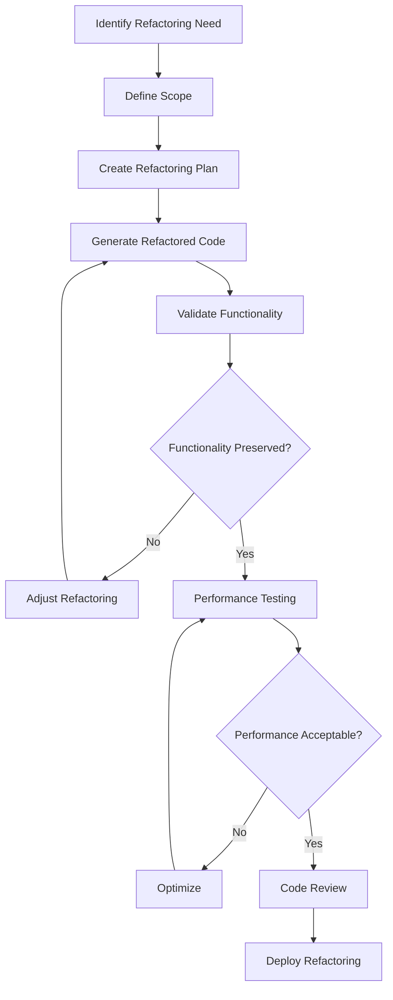

# AI Collaboration Guide for Asthra Compiler

**Version:** 1.0  
**Date:** January 7, 2025  
**Audience:** Human developers working with AI systems on compiler development  

## Table of Contents

1. [Overview](#overview)
2. [Working with AI-Generated Code](#working-with-ai-generated-code)
3. [Code Review for AI Code](#code-review-for-ai-code)
4. [Prompt Engineering](#prompt-engineering)
5. [Quality Assurance](#quality-assurance)
6. [AI Development Workflows](#ai-development-workflows)
7. [Common Challenges and Solutions](#common-challenges-and-solutions)
8. [Best Practices](#best-practices)

## Overview

The Asthra compiler represents a successful collaboration between human developers and AI systems. This guide provides practical advice for human developers working with AI to extend, maintain, and improve the compiler codebase.

### Collaboration Philosophy

Effective human-AI collaboration in compiler development is based on:

1. **Complementary Strengths**: AI excels at pattern recognition and code generation; humans excel at high-level design and validation
2. **Iterative Development**: Build functionality incrementally with continuous validation
3. **Clear Communication**: Use precise, unambiguous language when directing AI
4. **Systematic Validation**: Thoroughly test all AI-generated code
5. **Knowledge Transfer**: Document patterns and decisions for future reference

### AI Capabilities and Limitations

**AI Strengths:**
- Pattern recognition and replication
- Code generation following established patterns
- Comprehensive test case generation
- Documentation creation
- Refactoring and optimization

**AI Limitations:**
- High-level architectural decisions
- Complex debugging and root cause analysis
- Performance optimization requiring domain expertise
- Integration with external systems
- Understanding of business requirements

## Working with AI-Generated Code

### 1. Understanding AI Code Patterns

AI-generated code in the Asthra compiler follows consistent patterns:

```c
// Typical AI-generated function structure
AsthraResult ai_generated_function(
    const Input* input,           // Always validate inputs
    Output* output,               // Clear output parameters
    Context* context              // Context for state management
) {
    // Input validation (always present)
    if (!input || !output) {
        return ASTHRA_ERROR_NULL_POINTER;
    }
    
    // Main logic (follows established patterns)
    // ...
    
    // Cleanup and return (consistent error handling)
    return ASTHRA_SUCCESS;
}
```

**Key Characteristics:**
- Consistent error handling patterns
- Clear input validation
- Predictable function signatures
- Comprehensive documentation
- Modular design

### 2. Integrating AI Code

When integrating AI-generated code:

```c
// Example: Integrating AI-generated parser function
AsthraResult integrate_ai_parser_function(void) {
    // 1. Review the generated function
    AsthraResult result = review_generated_code(&parser_function);
    if (result != ASTHRA_SUCCESS) {
        return result;
    }
    
    // 2. Test the function in isolation
    result = test_function_isolation(&parser_function);
    if (result != ASTHRA_SUCCESS) {
        return result;
    }
    
    // 3. Test integration with existing code
    result = test_function_integration(&parser_function);
    if (result != ASTHRA_SUCCESS) {
        return result;
    }
    
    // 4. Update documentation and tests
    result = update_documentation(&parser_function);
    if (result != ASTHRA_SUCCESS) {
        return result;
    }
    
    return ASTHRA_SUCCESS;
}
```

### 3. Validating AI Implementations

Always validate AI-generated code through multiple approaches:

```c
// Validation checklist for AI-generated functions
typedef struct {
    bool input_validation_present;
    bool error_handling_consistent;
    bool memory_management_safe;
    bool follows_naming_conventions;
    bool has_comprehensive_tests;
    bool documentation_complete;
} AICodeValidation;

AsthraResult validate_ai_code(
    const Function* ai_function,
    AICodeValidation* validation
) {
    // Check input validation
    validation->input_validation_present = 
        check_input_validation(ai_function);
    
    // Check error handling
    validation->error_handling_consistent = 
        check_error_handling_patterns(ai_function);
    
    // Check memory management
    validation->memory_management_safe = 
        check_memory_safety(ai_function);
    
    // Check naming conventions
    validation->follows_naming_conventions = 
        check_naming_conventions(ai_function);
    
    // Check test coverage
    validation->has_comprehensive_tests = 
        check_test_coverage(ai_function);
    
    // Check documentation
    validation->documentation_complete = 
        check_documentation_quality(ai_function);
    
    return ASTHRA_SUCCESS;
}
```

## Code Review for AI Code

### 1. Review Checklist

When reviewing AI-generated code, focus on:

**Architecture and Design:**
- [ ] Follows established architectural patterns
- [ ] Maintains module boundaries
- [ ] Uses appropriate data structures
- [ ] Implements correct algorithms

**Code Quality:**
- [ ] Consistent with existing code style
- [ ] Proper error handling
- [ ] Safe memory management
- [ ] Clear variable and function names

**Functionality:**
- [ ] Implements required functionality correctly
- [ ] Handles edge cases appropriately
- [ ] Integrates properly with existing code
- [ ] Maintains backward compatibility

**Testing:**
- [ ] Comprehensive test coverage
- [ ] Tests cover edge cases
- [ ] Tests are maintainable
- [ ] Performance tests included where appropriate

### 2. Common Review Issues

**Pattern Deviations:**
```c
// ❌ AI sometimes generates inconsistent patterns
AsthraResult inconsistent_function(Input input) {  // Missing const, pointer
    // Missing input validation
    // Implementation...
    return 0;  // Should return ASTHRA_SUCCESS
}

// ✅ Corrected to follow patterns
AsthraResult consistent_function(const Input* input, Output* output) {
    if (!input || !output) {
        return ASTHRA_ERROR_NULL_POINTER;
    }
    // Implementation...
    return ASTHRA_SUCCESS;
}
```

**Memory Management Issues:**
```c
// ❌ AI might miss cleanup in error paths
AsthraResult problematic_function(const Input* input, Output* output) {
    char* buffer = malloc(1024);
    
    if (some_condition) {
        return ASTHRA_ERROR_INVALID_INPUT;  // Memory leak!
    }
    
    // Use buffer...
    free(buffer);
    return ASTHRA_SUCCESS;
}

// ✅ Corrected with proper cleanup
AsthraResult corrected_function(const Input* input, Output* output) {
    char* buffer = malloc(1024);
    AsthraResult result = ASTHRA_SUCCESS;
    
    if (some_condition) {
        result = ASTHRA_ERROR_INVALID_INPUT;
        goto cleanup;
    }
    
    // Use buffer...
    
cleanup:
    free(buffer);
    return result;
}
```

### 3. Review Process

1. **Automated Checks**: Run static analysis and linting tools
2. **Pattern Verification**: Ensure code follows established patterns
3. **Integration Testing**: Test with existing codebase
4. **Performance Review**: Check for performance implications
5. **Documentation Review**: Verify documentation accuracy and completeness

## Prompt Engineering

### 1. Effective Prompts for Compiler Development

**Structure for Implementation Prompts:**
```
Context: [Brief description of the task and its place in the compiler]
Requirements: [Specific functional requirements]
Constraints: [Technical constraints and limitations]
Patterns: [Reference to existing patterns to follow]
Examples: [Code examples or references to similar implementations]
Validation: [How the implementation should be tested]
```

**Example Prompt:**
```
Context: Implement a new AST node type for handling switch expressions in the Asthra parser.

Requirements:
- Parse switch expressions with pattern matching
- Support multiple case patterns
- Handle default cases
- Integrate with existing expression parsing

Constraints:
- Follow existing AST node patterns in src/parser/ast_nodes.h
- Use memory pool allocation for AST nodes
- Maintain compatibility with existing semantic analysis

Patterns:
- Follow the pattern established by if-expression nodes
- Use the standard AST visitor pattern for processing
- Implement consistent error handling

Examples:
- Reference the implementation of if-expressions in parser_expressions.c
- Follow the pattern of enum-match expressions for pattern handling

Validation:
- Create comprehensive test cases covering all switch patterns
- Test integration with semantic analysis
- Verify memory management with valgrind
```

### 2. Prompt Templates

**For New Feature Implementation:**
```
Implement [feature name] for the Asthra compiler.

Context:
- Location: [source file/module]
- Purpose: [what the feature does]
- Integration: [how it fits with existing code]

Requirements:
1. [Specific requirement 1]
2. [Specific requirement 2]
3. [Specific requirement 3]

Follow these patterns:
- [Pattern reference 1]
- [Pattern reference 2]

Include:
- Comprehensive error handling
- Memory safety
- Unit tests
- Documentation
```

**For Bug Fixes:**
```
Fix the following issue in the Asthra compiler:

Problem: [Detailed description of the bug]
Location: [File and function where bug occurs]
Symptoms: [What happens when bug occurs]
Expected: [What should happen instead]

Context:
- [Relevant background information]
- [Related code or systems]

Constraints:
- Maintain backward compatibility
- Follow existing error handling patterns
- Ensure fix doesn't introduce new issues

Testing:
- Create test case that reproduces the bug
- Verify fix resolves the issue
- Run regression tests
```

### 3. Iterative Refinement

Use iterative prompts to refine AI output:

1. **Initial Implementation**: Get basic functionality working
2. **Pattern Alignment**: Refine to match established patterns
3. **Error Handling**: Improve error handling and edge cases
4. **Performance**: Optimize for performance if needed
5. **Documentation**: Add comprehensive documentation
6. **Testing**: Expand test coverage

## Quality Assurance

### 1. Testing AI-Generated Code

**Multi-Level Testing Approach:**

```c
// Level 1: Unit tests for individual functions
void test_ai_generated_function(void) {
    // Test normal cases
    test_normal_operation();
    
    // Test edge cases
    test_edge_cases();
    
    // Test error conditions
    test_error_conditions();
    
    // Test memory management
    test_memory_management();
}

// Level 2: Integration tests
void test_ai_code_integration(void) {
    // Test with existing modules
    test_module_integration();
    
    // Test data flow
    test_data_flow();
    
    // Test error propagation
    test_error_propagation();
}

// Level 3: System tests
void test_ai_code_system(void) {
    // Test full compilation pipeline
    test_full_pipeline();
    
    // Test with real code samples
    test_real_world_examples();
    
    // Test performance characteristics
    test_performance();
}
```

### 2. Automated Quality Checks

Set up automated checks for AI-generated code:

```bash
#!/bin/bash
# AI code quality check script

echo "Running quality checks on AI-generated code..."

# Static analysis
echo "1. Running static analysis..."
clang-static-analyzer src/

# Memory safety checks
echo "2. Running memory safety checks..."
valgrind --tool=memcheck --leak-check=full ./test_suite

# Code style checks
echo "3. Checking code style..."
clang-format --dry-run --Werror src/

# Pattern compliance checks
echo "4. Checking pattern compliance..."
./scripts/check_patterns.py src/

# Test coverage
echo "5. Checking test coverage..."
gcov src/*.c
lcov --capture --directory . --output-file coverage.info

echo "Quality checks complete."
```

### 3. Performance Validation

Validate performance of AI-generated code:

```c
// Performance testing framework for AI code
typedef struct {
    const char* function_name;
    double execution_time_ms;
    size_t memory_usage_bytes;
    size_t allocations_count;
} PerformanceMetrics;

AsthraResult measure_ai_function_performance(
    const char* function_name,
    TestFunction test_func,
    PerformanceMetrics* metrics
) {
    // Measure execution time
    clock_t start = clock();
    AsthraResult result = test_func();
    clock_t end = clock();
    
    metrics->execution_time_ms = 
        ((double)(end - start) / CLOCKS_PER_SEC) * 1000.0;
    
    // Measure memory usage (using custom allocator)
    metrics->memory_usage_bytes = get_peak_memory_usage();
    metrics->allocations_count = get_allocation_count();
    
    return result;
}
```

## AI Development Workflows

### 1. Feature Development Workflow



### 2. Bug Fix Workflow



### 3. Refactoring Workflow



## Common Challenges and Solutions

### 1. Pattern Inconsistency

**Challenge**: AI generates code that doesn't follow established patterns.

**Solution**:
```c
// Create pattern templates for AI to follow
// Template: Error handling pattern
#define AI_FUNCTION_TEMPLATE(name, input_type, output_type) \
AsthraResult name(const input_type* input, output_type* output) { \
    if (!input || !output) { \
        return ASTHRA_ERROR_NULL_POINTER; \
    } \
    /* Implementation here */ \
    return ASTHRA_SUCCESS; \
}

// Use in prompts: "Follow the AI_FUNCTION_TEMPLATE pattern"
```

### 2. Memory Management Issues

**Challenge**: AI sometimes generates code with memory leaks or unsafe memory access.

**Solution**:
```c
// Provide memory management helpers
typedef struct {
    void* ptr;
    size_t size;
    bool is_allocated;
} SafePointer;

SafePointer* safe_alloc(size_t size) {
    SafePointer* sp = malloc(sizeof(SafePointer));
    if (!sp) return NULL;
    
    sp->ptr = malloc(size);
    if (!sp->ptr) {
        free(sp);
        return NULL;
    }
    
    sp->size = size;
    sp->is_allocated = (sp->ptr != NULL);
    
    return sp;
}

void safe_free(SafePointer* sp) {
    if (sp && sp->is_allocated) {
        free(sp->ptr);
        sp->ptr = NULL;
        sp->is_allocated = false;
    }
    free(sp);
}
```

### 3. Integration Complexity

**Challenge**: AI-generated code doesn't integrate well with existing systems.

**Solution**:
```c
// Create integration interfaces
typedef struct {
    AsthraResult (*validate)(const void* data);
    AsthraResult (*transform)(const void* input, void* output);
    AsthraResult (*integrate)(void* system, const void* component);
} IntegrationInterface;

// Use in AI prompts: "Implement using IntegrationInterface"
```

### 4. Test Coverage Gaps

**Challenge**: AI doesn't generate comprehensive tests.

**Solution**:
```c
// Provide test generation templates
#define GENERATE_BASIC_TESTS(function_name, input_type, output_type) \
void test_##function_name##_normal(void) { \
    input_type input = create_normal_input(); \
    output_type output = {0}; \
    AsthraResult result = function_name(&input, &output); \
    ASSERT_EQ(ASTHRA_SUCCESS, result); \
} \
\
void test_##function_name##_null_input(void) { \
    output_type output = {0}; \
    AsthraResult result = function_name(NULL, &output); \
    ASSERT_EQ(ASTHRA_ERROR_NULL_POINTER, result); \
} \
\
void test_##function_name##_null_output(void) { \
    input_type input = create_normal_input(); \
    AsthraResult result = function_name(&input, NULL); \
    ASSERT_EQ(ASTHRA_ERROR_NULL_POINTER, result); \
}
```

## Best Practices

### 1. Communication with AI

**Be Specific and Clear:**
```
❌ "Fix the parser"
✅ "Fix the parser function parse_expression() in src/parser/expressions.c 
   to correctly handle nested parentheses in arithmetic expressions"
```

**Provide Context:**
```
❌ "Add error handling"
✅ "Add error handling following the pattern in lexer_scan_token(), 
   returning ASTHRA_ERROR_INVALID_INPUT for malformed syntax and 
   ASTHRA_ERROR_OUT_OF_MEMORY for allocation failures"
```

**Reference Existing Code:**
```
❌ "Implement a hash table"
✅ "Implement a hash table following the pattern in src/semantic/symbol_table.c,
   using the same hash function and collision resolution strategy"
```

### 2. Iterative Development

1. **Start Simple**: Begin with basic functionality
2. **Add Complexity Gradually**: Build up features incrementally
3. **Validate Each Step**: Test thoroughly at each stage
4. **Refine Based on Feedback**: Use test results to improve

### 3. Documentation and Knowledge Transfer

```c
// Document AI collaboration decisions
/**
 * @brief AI-generated function for parsing switch expressions
 * 
 * @ai_generated 2025-01-07
 * @ai_prompt "Implement switch expression parsing following if-expression pattern"
 * @ai_iterations 3
 * @human_modifications "Added bounds checking for case array"
 * 
 * This function was generated by AI and refined through human review.
 * Key modifications made during review:
 * - Added bounds checking for case array access
 * - Improved error messages for better debugging
 * - Optimized memory allocation pattern
 */
AsthraResult parse_switch_expression(/* ... */);
```

### 4. Continuous Improvement

- **Learn from AI Output**: Understand what works well and what doesn't
- **Refine Prompts**: Improve prompts based on experience
- **Update Patterns**: Evolve patterns based on successful AI collaborations
- **Share Knowledge**: Document successful collaboration patterns for the team

## Conclusion

Successful human-AI collaboration in compiler development requires:

1. **Clear Communication**: Use precise, unambiguous language
2. **Systematic Validation**: Thoroughly test all AI-generated code
3. **Pattern Consistency**: Maintain established coding patterns
4. **Iterative Refinement**: Improve through multiple iterations
5. **Knowledge Sharing**: Document successful collaboration patterns

By following these guidelines, human developers can effectively collaborate with AI systems to build and maintain the Asthra compiler while ensuring code quality, maintainability, and reliability.

The key to success is treating AI as a powerful tool that amplifies human capabilities rather than replacing human judgment and expertise. The combination of AI's pattern recognition and code generation capabilities with human architectural insight and validation creates a powerful development approach for complex systems like compilers. 