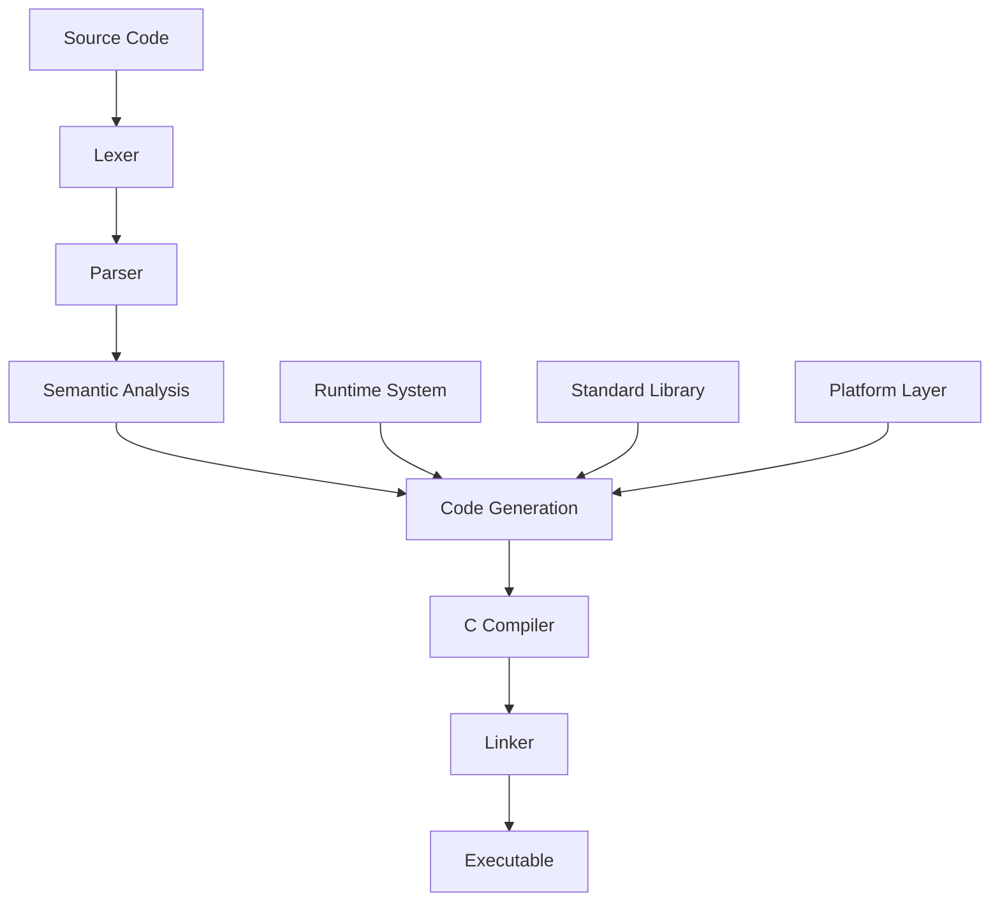

# Architecture Overview

**High-level guide to understanding the Asthra compiler architecture**

This guide provides a comprehensive overview of the Asthra compiler's architecture, design decisions, and system organization for contributors.

## Overview

- **Purpose**: Understand the overall system architecture and design philosophy
- **Audience**: All contributors, especially those new to the project
- **Prerequisites**: Basic understanding of compilers and software architecture
- **Outcome**: Clear mental model of how Asthra components work together

## System Architecture

### High-Level View

The Asthra compiler is designed as a modular, AI-friendly system that transforms Asthra source code into efficient executables:

```
┌─────────────────┐    ┌─────────────────┐    ┌─────────────────┐
│   Source Code   │───▶│  Asthra Compiler │───▶│   Executable    │
│   (.asthra)     │    │                 │    │    Binary       │
└─────────────────┘    └─────────────────┘    └─────────────────┘
                              │
                              ▼
                    ┌─────────────────┐
                    │   Generated     │
                    │   C Code        │
                    └─────────────────┘
```

### Core Design Principles

#### 1. AI Generation Efficiency
- **Minimal Syntax**: Reduced cognitive load for AI models
- **Deterministic Parsing**: No ambiguous language constructs
- **Consistent Patterns**: Predictable code generation patterns
- **Clear Error Messages**: Actionable feedback for AI debugging

#### 2. Memory Safety
- **Four-Zone Memory Model**: GC, Manual, Pinned, External zones
- **Ownership Tracking**: Clear ownership semantics
- **Bounds Checking**: Automatic array bounds validation
- **Safe FFI**: Memory-safe C interoperability

#### 3. Modular Architecture
- **Component Isolation**: Clear boundaries between compiler phases
- **Parallel Development**: Independent component development
- **Testability**: Isolated testing of individual components
- **Maintainability**: Focused responsibilities per module

#### 4. Performance
- **Zero-Cost Abstractions**: No runtime overhead for language features
- **Monomorphization**: Specialized code for generic types
- **C Backend**: Leverage mature C compiler optimizations
- **Incremental Compilation**: Fast rebuild cycles

## Compilation Pipeline

### Phase Overview



### Phase 1: Lexical Analysis

**Purpose**: Convert source text into tokens  
**Location**: `src/parser/lexer_*.c`  
**Key Features**:
- Modular lexer design with specialized scanners
- Support for all literal types (hex, binary, octal, strings)
- Comprehensive error recovery and reporting
- Memory-safe token management

```c
// Example: Lexer processing
Source: "fn main() -> i32 { return 42; }"
Tokens: [FN, IDENTIFIER("main"), LEFT_PAREN, RIGHT_PAREN, 
         ARROW, IDENTIFIER("i32"), LEFT_BRACE, RETURN, 
         NUMBER("42"), SEMICOLON, RIGHT_BRACE, EOF]
```

### Phase 2: Parsing

**Purpose**: Build Abstract Syntax Tree from tokens  
**Location**: `src/parser/grammar_*.c`  
**Key Features**:
- PEG (Parsing Expression Grammar) implementation
- Modular grammar rules split across focused files
- Comprehensive AST node types
- Advanced error recovery with helpful messages

```c
// Example: AST structure for function
ASTNode {
    type: AST_FUNCTION,
    data: {
        function: {
            name: "main",
            parameters: [],
            return_type: AST_BASE_TYPE("i32"),
            body: AST_BLOCK([
                AST_RETURN(AST_LITERAL("42"))
            ])
        }
    }
}
```

### Phase 3: Semantic Analysis

**Purpose**: Type checking, symbol resolution, and validation  
**Location**: `src/analysis/semantic_*.c`  
**Key Features**:
- Sophisticated type inference system
- Multi-scope symbol table management
- Annotation validation and conflict detection
- Generic type instantiation

```c
// Example: Symbol table after analysis
SymbolTable {
    symbols: [
        Symbol {
            name: "main",
            type: SYMBOL_FUNCTION,
            type_info: FunctionType {
                parameters: [],
                return_type: PrimitiveType(I32)
            }
        }
    ]
}
```

### Phase 4: Code Generation

**Purpose**: Generate C code and FFI assembly  
**Location**: `src/codegen/`  
**Key Features**:
- Safe C interoperability through FFI assembly
- Generic instantiation with zero-cost monomorphization
- ELF binary generation for direct execution
- Comprehensive optimization pipeline

```c
// Example: Generated C code
int main(void) {
    return 42;
}
```

## Directory Structure

### Source Code Organization

```
src/
├── parser/              # Lexical analysis and parsing
│   ├── lexer_*.c       # Tokenization components
│   └── grammar_*.c     # Grammar rule implementations
├── analysis/           # Semantic analysis
│   ├── semantic_*.c    # Type checking and validation
│   └── symbol_*.c      # Symbol table management
├── codegen/            # Code generation
│   ├── codegen_*.c     # C code generation
│   └── optimization/   # Optimization passes
├── runtime/            # Runtime system
│   ├── memory/         # Memory management
│   ├── concurrency/    # Threading and synchronization
│   └── stdlib/         # Standard library implementations
├── utils/              # Utility functions
│   ├── json_utils.c    # JSON parsing and generation
│   └── string_utils.c  # String manipulation
└── tools/              # Development tools
    ├── linter.c        # Code linting
    └── formatter.c     # Code formatting
```

### Test Organization

```
tests/
├── lexer/              # Lexer tests
├── parser/             # Parser tests
├── semantic/           # Semantic analysis tests
├── codegen/            # Code generation tests
├── integration/        # End-to-end tests
├── performance/        # Performance benchmarks
└── framework/          # Testing framework
```

### Documentation Structure

```
docs/
├── contributor/        # Contributor documentation
│   ├── guides/        # Development guides
│   ├── workflows/     # Development workflows
│   └── reference/     # Reference materials
├── user-manual/       # User documentation
├── spec/              # Language specification
└── architecture/      # Architecture documentation
```

## Key Components

### Memory Management System

#### Four-Zone Memory Model

```c
typedef enum {
    MEMORY_ZONE_GC,        // Garbage collected
    MEMORY_ZONE_MANUAL,    // Manual management
    MEMORY_ZONE_PINNED,    // Pinned memory
    MEMORY_ZONE_EXTERNAL   // External library memory
} MemoryZone;
```

**GC Zone**: Automatic memory management for most objects  
**Manual Zone**: Explicit control for performance-critical code  
**Pinned Zone**: Memory that won't move (for FFI)  
**External Zone**: Memory managed by external libraries

#### Ownership Tracking

```c
typedef enum {
    OWNERSHIP_OWNED,       // Full ownership
    OWNERSHIP_BORROWED,    // Temporary access
    OWNERSHIP_SHARED,      // Shared ownership
    OWNERSHIP_EXTERNAL     // External ownership
} OwnershipType;
```

### Type System

#### Type Hierarchy

```c
typedef enum {
    TYPE_PRIMITIVE,        // i32, f64, bool, char
    TYPE_POINTER,          // *T, *mut T
    TYPE_ARRAY,            // [T; N]
    TYPE_SLICE,            // [T]
    TYPE_STRUCT,           // struct { ... }
    TYPE_ENUM,             // enum { ... }
    TYPE_FUNCTION,         // fn(T, U) -> V
    TYPE_GENERIC,          // T (generic parameter)
    TYPE_INFERRED          // Type to be inferred
} TypeKind;
```

#### Generic System

```c
// Generic struct definition
struct Vec<T> {
    data: *mut T,
    length: usize,
    capacity: usize,
}

// Monomorphization generates:
// Vec_i32, Vec_f64, Vec_String, etc.
```

### Concurrency Model

#### Three-Tier System

**Tier 1**: `spawn`/`await` for deterministic concurrency
```asthra
let task = spawn {
    compute_heavy_operation()
};
let result = await task;
```

**Tier 2**: Channels and `select` for communication
```asthra
let (sender, receiver) = channel::<i32>();
spawn {
    sender.send(42);
};
let value = receiver.recv();
```

**Tier 3**: External library integration
```asthra
#[external_lib("pthread")]
fn pthread_create(thread: *mut pthread_t, attr: *const pthread_attr_t, 
                 start_routine: fn(*mut void) -> *mut void, 
                 arg: *mut void) -> i32;
```

### FFI System

#### Automatic C Binding Generation

```asthra
// Asthra declaration
#[export_c]
fn calculate(a: i32, b: i32) -> i32 {
    return a + b;
}

// Generated C header
int calculate(int a, int b);

// Generated C implementation
int calculate(int a, int b) {
    return asthra_calculate(a, b);
}
```

#### Transfer Semantics

```asthra
#[transfer_full]    // Caller takes ownership
#[transfer_none]    // Callee retains ownership
#[transfer_container] // Transfer container, not contents
```

## Build System Architecture

### Modular Makefile System

```
Makefile                 # Main entry point
make/
├── paths.mk            # Path definitions
├── compiler.mk         # Compiler settings
├── tests.mk            # Test orchestration
├── utils.mk            # Utility functions
├── third-party.mk      # External dependencies
└── tests/              # Test-specific makefiles
    ├── lexer.mk
    ├── parser.mk
    └── ...
```

### Build Variants

```bash
# Debug build (default)
make

# Release build
make release

# Profile build
make profile

# Coverage build
make coverage

# AddressSanitizer build
make asan

# ThreadSanitizer build
make tsan
```

### Parallel Compilation

```bash
# Parallel compilation
make -j8

# Parallel testing
make test-all -j4

# Component-specific builds
make lexer parser semantic codegen
```

## Platform Support

### Target Architectures

**x86_64**: Primary development and testing platform  
**ARM64**: Full support for Apple Silicon and ARM servers  
**WASM32**: WebAssembly target for browser deployment

### Operating Systems

**macOS**: Primary development platform with full toolchain  
**Linux**: Complete support with Clang integration  
**Windows**: Cross-compilation support via MinGW

### Toolchain Integration

**Clang**: Preferred compiler with enhanced diagnostics  
**Clang**: Full compatibility with fallback support  
**Make**: Modular build system with parallel compilation  
**Static Analysis**: Integrated linting and safety checks

## Performance Characteristics

### Compilation Speed

- **Modular compilation**: Only recompile changed modules
- **Parallel parsing**: Independent grammar rules
- **Incremental analysis**: Cache semantic analysis results
- **Fast lexing**: Optimized character scanning

### Memory Usage

- **Streaming lexer**: Minimal token buffering
- **AST sharing**: Reference counting for common nodes
- **Symbol interning**: Deduplicated identifier storage
- **Garbage collection**: Automatic memory management during compilation

### Generated Code Quality

- **Zero-cost abstractions**: No runtime overhead for language features
- **Monomorphization**: Specialized code for generic types
- **C compiler optimization**: Leverage LLVM/Clang optimizations
- **FFI efficiency**: Direct C function calls without marshaling overhead

## Development Workflow Integration

### AI-Assisted Development

The architecture is specifically designed to support AI-assisted development:

1. **Predictable Patterns**: Consistent code organization for AI understanding
2. **Modular Components**: Clear boundaries for AI-generated code
3. **Comprehensive Testing**: Validation of AI-generated contributions
4. **Clear Documentation**: Context for AI code generation

### Continuous Integration

```yaml
# Example CI pipeline
stages:
  - build
  - test
  - analyze
  - deploy

build:
  script:
    - make clean
    - make -j8
    - make test-all

analyze:
  script:
    - make static-analysis
    - make coverage-report
    - make performance-benchmark
```

## Extensibility Points

### Adding New Language Features

1. **Lexer Extension**: Add new token types
2. **Grammar Extension**: Add new parsing rules
3. **Semantic Extension**: Add type checking rules
4. **Codegen Extension**: Add code generation patterns

### Plugin Architecture

```c
// Plugin interface
typedef struct {
    const char *name;
    const char *version;
    bool (*initialize)(void);
    void (*cleanup)(void);
    void (*process_ast)(ASTNode *node);
} CompilerPlugin;
```

### Custom Optimization Passes

```c
// Optimization pass interface
typedef struct {
    const char *name;
    bool (*should_run)(OptimizationContext *ctx);
    bool (*run_pass)(OptimizationContext *ctx, ASTNode *ast);
    void (*report_statistics)(OptimizationContext *ctx);
} OptimizationPass;
```

## Success Criteria

You understand the Asthra architecture when:

- [ ] **System Overview**: Can explain the compilation pipeline and major components
- [ ] **Design Principles**: Understand the AI-friendly design decisions
- [ ] **Component Interactions**: Know how different parts work together
- [ ] **Memory Model**: Understand the four-zone memory management system
- [ ] **Build System**: Can navigate and use the modular build system
- [ ] **Extensibility**: Know how to add new features and components

## Related Guides

- **[Compiler Development](compiler-development.md)** - Deep dive into compiler implementation
- **[Development Environment](development-environment.md)** - Setting up your development environment
- **[Testing Guide](testing-guide.md)** - Understanding the testing architecture
- **[Code Style Guide](code-style.md)** - Coding standards and conventions

## Reference Materials

- **[Detailed Architecture Docs](../reference/architecture/)** - In-depth component documentation
- **[API Reference](../reference/api/)** - Complete API documentation
- **[Language Specification](../reference/language-spec.md)** - Asthra language definition
- **[Build System Reference](../reference/build-system.md)** - Complete build system documentation

---

**🏗️ Architecture Understanding Complete!**

*Understanding the overall architecture provides the foundation for effective contribution to any part of the Asthra compiler system. The modular design enables focused development while maintaining system coherence.* 