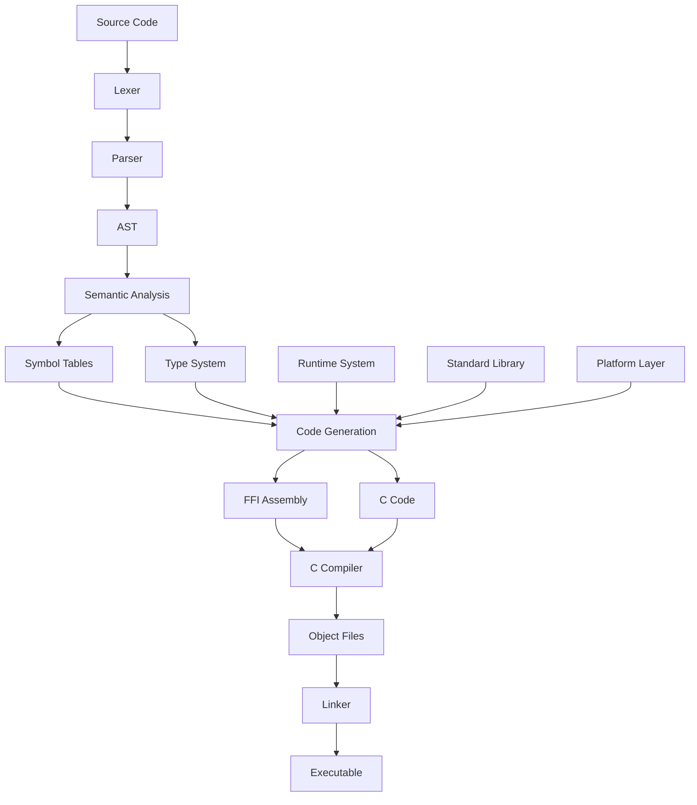

# Asthra Compiler Architecture

**Version:** 1.0  
**Date:** January 2025  
**Status:** Active Development  

## Overview

The Asthra programming language compiler is a sophisticated, modular system designed for AI-friendly code generation and safe systems programming. Built primarily through AI-assisted development, the compiler implements a complete compilation pipeline from source code to executable binaries with strong emphasis on memory safety, concurrency, and FFI interoperability.

## Compilation Pipeline

The Asthra compiler follows a traditional multi-phase compilation approach with modern optimizations:

```
Source Code (.asthra)
        ↓
    [Lexer] → Tokens
        ↓
    [Parser] → Abstract Syntax Tree (AST)
        ↓
[Semantic Analysis] → Validated AST + Symbol Tables
        ↓
[Code Generation] → C Code + FFI Assembly
        ↓
    [C Compiler] → Object Files
        ↓
    [Linker] → Executable Binary
```

### Phase 1: Lexical Analysis
- **Location**: `src/parser/lexer_*.c`
- **Purpose**: Converts source text into tokens
- **Key Features**:
  - Modular lexer design with separate scanning functions
  - Support for hex/binary/octal literals (0xFF, 0b1010, 0o755)
  - Comprehensive error recovery and reporting
  - Memory-safe token management with proper cloning

### Phase 2: Parsing
- **Location**: `src/parser/grammar_*.c`
- **Purpose**: Builds Abstract Syntax Tree from tokens
- **Key Features**:
  - PEG (Parsing Expression Grammar) implementation
  - Modular grammar rules split across focused files
  - Comprehensive AST node types for all language constructs
  - Advanced error recovery with helpful messages

### Phase 3: Semantic Analysis
- **Location**: `src/analysis/semantic_*.c`
- **Purpose**: Type checking, symbol resolution, and validation
- **Key Features**:
  - Sophisticated type inference system
  - Multi-scope symbol table management
  - Annotation validation and conflict detection
  - Generic type instantiation and monomorphization

### Phase 4: Code Generation
- **Location**: `src/codegen/`
- **Purpose**: Generates C code and FFI assembly
- **Key Features**:
  - Safe C interoperability through FFI assembly
  - Generic instantiation with zero-cost monomorphization
  - ELF binary generation for direct execution
  - Comprehensive optimization pipeline

## Key Design Principles

### 1. AI Generation Efficiency
- **Minimal syntax** for maximum AI model predictability
- **Deterministic parsing** with no ambiguous constructs
- **Consistent patterns** across all language features
- **Clear error messages** for AI debugging

### 2. Memory Safety
- **Four-zone memory model**: GC, Manual, Pinned, External
- **Ownership tracking** with transfer semantics
- **Bounds checking** for all array operations
- **Safe FFI** with automatic marshaling

### 3. Concurrency Model
- **Three-tier system**:
  - Tier 1: `spawn`/`await` for deterministic concurrency
  - Tier 2: Channels and `select` for communication
  - Tier 3: External library integration
- **Thread safety** guarantees at compile time
- **Deadlock prevention** through static analysis

### 4. FFI Safety
- **Automatic C binding generation** from Asthra declarations
- **Transfer semantic annotations** (`#[transfer_full]`, `#[transfer_none]`)\
- **Type safety** across language boundaries
- **Memory ownership** tracking in FFI calls

### 5. Modular Architecture
- **Component isolation** for maintainability
- **Clear interfaces** between compilation phases
- **Parallel development** support
- **Comprehensive testing** at all levels

## Module Dependency Graph



## Data Flow

### Source to AST
1. **Lexer** scans source text character by character
2. **Token stream** generated with position information
3. **Parser** consumes tokens using recursive descent
4. **AST nodes** created with full type information
5. **Memory management** ensures proper cleanup

### AST to Executable
1. **Symbol resolution** builds scope-aware symbol tables
2. **Type inference** determines types for all expressions
3. **Semantic validation** checks language rules and constraints
4. **Code generation** produces C code with FFI bindings
5. **Compilation** uses system C compiler for optimization
6. **Linking** creates final executable with runtime

## Performance Characteristics

### Compilation Speed
- **Modular compilation**: Only recompile changed modules
- **Parallel parsing**: Independent grammar rules
- **Incremental analysis**: Cache semantic analysis results
- **Fast lexing**: Optimized character scanning

### Memory Usage
- **Streaming lexer**: Minimal token buffering
- **AST sharing**: Reference counting for common nodes
- **Symbol interning**: Deduplicated identifier storage
- **Garbage collection**: Automatic memory management during compilation

### Generated Code Quality
- **Zero-cost abstractions**: No runtime overhead for language features
- **Monomorphization**: Specialized code for generic types
- **C compiler optimization**: Leverage LLVM/Clang optimizations
- **FFI efficiency**: Direct C function calls without marshaling overhead

## Platform Support

### Target Architectures
- **x86_64**: Primary development and testing platform
- **ARM64**: Full support for Apple Silicon and ARM servers
- **WASM32**: WebAssembly target for browser deployment

### Operating Systems
- **macOS**: Primary development platform with full toolchain
- **Linux**: Complete support with Clang integration
- **Windows**: Cross-compilation support via MinGW

### Toolchain Integration
- **Clang**: Preferred compiler with enhanced diagnostics
- **Clang**: Full compatibility with fallback support
- **Make**: Modular build system with parallel compilation
- **Static Analysis**: Integrated linting and safety checks

## Key Architectural Decisions

### Why PEG Grammar?
- **Deterministic parsing**: No ambiguity in language constructs
- **AI-friendly**: Predictable parsing behavior for code generation
- **Composable**: Easy to extend with new language features
- **Error recovery**: Better error messages than LR parsers

### Why C Code Generation?
- **Portability**: C compilers available on all platforms
- **Optimization**: Leverage mature C compiler optimizations
- **Debugging**: Standard debugging tools work with generated C
- **FFI**: Natural interoperability with C libraries

### Why Modular Design?
- **AI Development**: Easier for AI to understand and modify focused modules
- **Parallel Development**: Multiple developers can work simultaneously
- **Testing**: Isolated testing of individual components
- **Maintenance**: Clear boundaries reduce complexity

### Why Four-Zone Memory Model?
- **Safety**: Different zones have different safety guarantees
- **Performance**: Manual zones for performance-critical code
- **FFI**: External zone for C library integration
- **Flexibility**: Developers choose appropriate memory management

## Next Steps

For detailed information about specific components:

- **[Directory Structure](directory-structure.md)**: File organization and naming conventions
- **[Build System](build-system.md)**: Compilation and dependency management
- **[Lexer and Parser](lexer-parser.md)**: Tokenization and AST construction
- **[Semantic Analysis](semantic-analysis.md)**: Type checking and validation
- **[Code Generation](code-generation.md)**: C code and FFI assembly generation
- **[Runtime System](runtime-system.md)**: Memory management and concurrency

For developers:
- **[Contributing Guide](../CONTRIBUTING.md)**: How to contribute to the compiler
- **[Debugging Guide](../guides/debugging-development.md)**: Debugging compiler issues
- **[Adding Features](../guides/adding-features.md)**: Implementing new language features

## Architecture Evolution

The Asthra compiler architecture has evolved through several key phases:

1. **Foundation** (2024): Basic lexer, parser, and AST infrastructure
2. **Type System** (2024): Comprehensive type inference and checking
3. **Code Generation** (2024): C code generation and FFI assembly
4. **Optimization** (2025): Performance improvements and advanced features
5. **Stabilization** (2025): Production readiness and comprehensive testing

The architecture continues to evolve with a focus on:
- **AI collaboration patterns** for sustainable development
- **Performance optimization** for large codebases
- **Advanced language features** like pattern matching and generics
- **Ecosystem integration** with package management and tooling

This architecture represents a modern approach to compiler design that balances traditional compiler engineering principles with the needs of AI-assisted development and safe systems programming. 