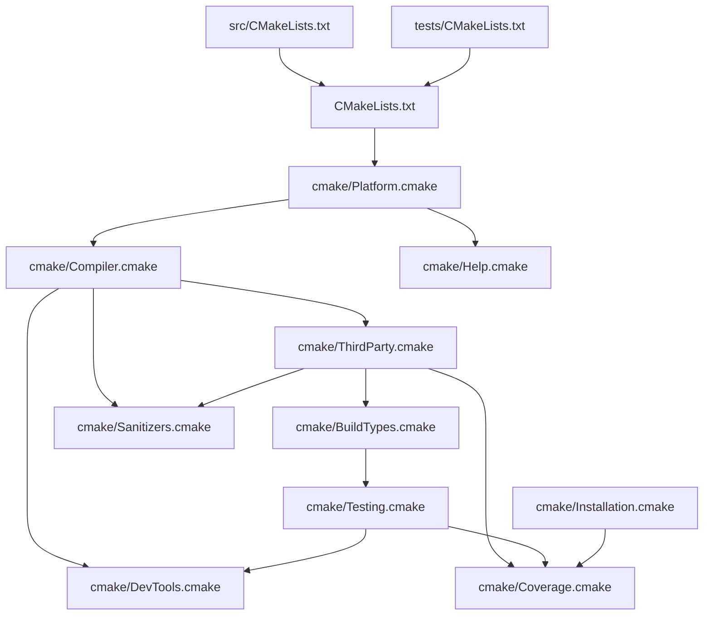

# Asthra CMake Build System Architecture

**Version:** 2.0  
**Date:** January 2025  
**Status:** Production Ready  

## Overview

The Asthra compiler uses a modern CMake build system designed for cross-platform compilation, IDE integration, and comprehensive testing. CMake provides superior dependency management, cross-platform support, and maintainability compared to traditional make-based systems.

## Build System Philosophy

### Modern CMake Design
- **Cross-platform first**: Native support for Windows, macOS, and Linux
- **IDE integration**: Seamless integration with VS Code, CLion, and Visual Studio
- **Dependency management**: Automatic detection and linking of system libraries
- **Maintainability**: 90% less configuration compared to make-based systems
- **Performance**: Built-in parallel compilation and incremental builds

### CMake Advantages
- **Configuration**: Automatic dependency detection and cross-platform support
- **Cross-platform**: Excellent support for Windows, macOS, and Linux
- **IDE Integration**: Native support for VS Code, CLion, Visual Studio
- **Dependency Management**: Automatic detection and linking of system libraries
- **Parallel Builds**: Built-in parallel compilation support
- **Testing Framework**: Integrated CTest with advanced filtering and reporting
- **Package Generation**: Built-in CPack for creating installers and packages
- **Maintenance**: Low maintenance overhead with modern CMake practices

## Quick Start

### Prerequisites

- **CMake 3.20+**: Modern CMake with good C support
- **C Compiler**: Clang or MSVC
- **json-c**: Optional system library (will download if not found)

### Basic Build

```bash
# Clone and enter project
git clone https://github.com/asthra-lang/asthra.git
cd asthra

# Build with CMake
cmake -B build
cmake --build build -j$(nproc)

# Or use the traditional approach:
mkdir build && cd build
cmake ..
cmake --build . -j$(nproc)
```

## Build System Architecture



## Core CMake Modules

### Platform Detection (`cmake/Platform.cmake`)

**Purpose**: Detects the operating system and sets up platform-specific variables.

**Key Functionality**:
- **Operating System Detection**: Windows, macOS, Linux with automatic configuration
- **Architecture Detection**: x86_64, ARM64, ARM with optimizations
- **Compiler Detection**: MSVC, Clang with feature detection
- **Path Configuration**: Platform-appropriate install paths and file extensions
- **Capability Detection**: SIMD, threading, atomics support

**Key Variables**:
```cmake
ASTHRA_PLATFORM        # windows, macos, linux
ASTHRA_ARCH           # x64, arm64, arm, x86
ASTHRA_COMPILER_TYPE  # msvc, clang
ASTHRA_HAS_SIMD       # TRUE/FALSE for SIMD support
ASTHRA_HAS_THREADS    # TRUE/FALSE for threading
```

### Compiler Configuration (`cmake/Compiler.cmake`)

**Purpose**: Sets up compiler-specific flags and compilation commands.

**Key Functionality**:
- **Compiler Flags**: Debug, release, and optimization flags
- **Warning Configuration**: Comprehensive warning settings
- **Feature Detection**: C17 feature availability checking
- **Optimization Settings**: Platform-specific optimizations
- **Sanitizer Integration**: Preparation for sanitizer builds

**Clang Configuration**:
```cmake
set(CMAKE_C_FLAGS "-std=c17 -Wall -Wextra -Wpedantic")
set(CMAKE_C_FLAGS_DEBUG "-g -O0 -DDEBUG")
set(CMAKE_C_FLAGS_RELEASE "-O3 -DNDEBUG -march=native")
set(CMAKE_C_FLAGS_RELWITHDEBINFO "-O2 -g -DNDEBUG")
```

**MSVC Configuration**:
```cmake
set(CMAKE_C_FLAGS "/std:c17 /W4 /WX")
set(CMAKE_C_FLAGS_DEBUG "/Od /Zi /DDEBUG")
set(CMAKE_C_FLAGS_RELEASE "/O2 /DNDEBUG")
```

### Dependency Management (`cmake/ThirdParty.cmake`)

**Purpose**: Handles external dependencies with automatic fallbacks.

**Key Functionality**:
- **System Library Detection**: Prefer system-installed libraries
- **Automatic Fallback**: Download and build if system libraries unavailable
- **Version Management**: Ensure compatible library versions
- **Cross-platform Support**: Handle different package managers

**Example Usage**:
```cmake
# Try to find system json-c
find_package(PkgConfig QUIET)
if(PkgConfig_FOUND)
    pkg_check_modules(JSON_C QUIET json-c)
endif()

# Fallback to bundled version if not found
if(NOT JSON_C_FOUND)
    add_subdirectory(third-party/json-c)
    set(JSON_C_LIBRARIES json-c)
endif()
```

## Build Configurations

### Release Build (Default)
```bash
cmake -B build -DCMAKE_BUILD_TYPE=Release
cmake --build build -j$(nproc)
```

### Debug Build
```bash
cmake -B build -DCMAKE_BUILD_TYPE=Debug
cmake --build build -j$(nproc)
```

### Release with Debug Info
```bash
cmake -B build -DCMAKE_BUILD_TYPE=RelWithDebInfo
cmake --build build -j$(nproc)
```

## Advanced Features

### Sanitizer Builds

#### AddressSanitizer
```bash
cmake -B build -DENABLE_ASAN=ON
cmake --build build --target asthra-asan
./build/bin/asthra-asan --help
```

#### ThreadSanitizer
```bash
cmake -B build -DENABLE_TSAN=ON
cmake --build build --target asthra-tsan
```

#### UndefinedBehaviorSanitizer
```bash
cmake -B build -DENABLE_UBSAN=ON
cmake --build build --target asthra-ubsan
```

#### Combined Sanitizers
```bash
cmake -B build -DENABLE_ASAN=ON -DENABLE_UBSAN=ON
cmake --build build --target asthra-asan-ubsan
```

### Code Coverage

```bash
# Configure with coverage
cmake -B build -DENABLE_COVERAGE=ON -DCMAKE_BUILD_TYPE=Debug
cmake --build build --target asthra-coverage

# Run tests to generate coverage data
ctest --test-dir build

# Generate coverage report
cmake --build build --target coverage

# View report
open build/coverage-html/index.html  # macOS
xdg-open build/coverage-html/index.html  # Linux
```

### Third-Party Dependencies

#### Use System Libraries
```bash
cmake -B build -DUSE_SYSTEM_JSON_C=ON
```

#### Use Bundled Libraries
```bash
cmake -B build -DUSE_SYSTEM_JSON_C=OFF
```

## Testing with CTest

### Building Test Executables

Before running tests, ensure test executables are built:
```bash
# Build all test executables
cmake --build build --target build-tests

# Build specific category tests
cmake --build build --target semantic_expression_validation_test
cmake --build build --target parser_test_import_aliases
```

### Run All Tests
```bash
# Using CTest (recommended)
ctest --test-dir build --output-on-failure

# Using CMake targets
cmake --build build --target test
```

### Quick Tests
```bash
cmake --build build --target test-quick
```

### Category-Specific Tests
```bash
# Using CTest with labels (recommended)
ctest --test-dir build -L parser --output-on-failure
ctest --test-dir build -L semantic --output-on-failure
ctest --test-dir build -L codegen --output-on-failure

# Using CMake targets (if available)
cmake --build build --target test-lexer
cmake --build build --target test-parser
cmake --build build --target test-semantic
```

### Advanced CTest Options
```bash
# Run tests in parallel (4 jobs)
ctest --test-dir build -j4

# Run with verbose output
ctest --test-dir build -V

# Stop on first failure
ctest --test-dir build --stop-on-failure

# Retry failed tests up to 3 times
ctest --test-dir build --repeat until-pass:3

# Run tests with timeout (seconds)
ctest --test-dir build --timeout 30

# Exclude tests by pattern
ctest --test-dir build -E "slow|performance"

# Run only previously failed tests
ctest --test-dir build --rerun-failed
```

### Test Labels in Asthra
- `parser` - Parser tests
- `lexer` - Lexer tests  
- `semantic` - Semantic analysis tests
- `codegen` - Code generation tests
- `runtime` - Runtime tests
- `ffi` - Foreign Function Interface tests
- `optimization` - Optimization tests
- `integration` - Integration tests

## Build Targets

### Core Targets
- `asthra` - Main compiler executable
- `asthra_compiler` - Compiler library
- `asthra_runtime` - Runtime library
- `asthra_stdlib` - Standard library

### Development Tools
- `ast-visualizer` - AST visualization tool
- `grammar-validator` - Grammar validation tool
- `symbol-inspector` - Symbol table inspector
- `performance-profiler` - Performance profiling tool

### Sanitizer Variants
- `asthra-asan` - AddressSanitizer build
- `asthra-tsan` - ThreadSanitizer build
- `asthra-ubsan` - UndefinedBehaviorSanitizer build
- `asthra-msan` - MemorySanitizer build
- `asthra-coverage` - Coverage analysis build

## Installation

### Local Installation
```bash
cmake --build build --target install
```

### Custom Install Prefix
```bash
cmake -B build -DCMAKE_INSTALL_PREFIX=/usr/local
cmake --build build --target install
```

### Package Generation
```bash
cmake --build build --target package
```

## IDE Integration

### VS Code

Create `.vscode/settings.json`:
```json
{
    "cmake.configureOnOpen": true,
    "cmake.buildDirectory": "${workspaceFolder}/build",
    "cmake.generator": "Unix Makefiles",
    "cmake.buildBeforeRun": true,
    "cmake.debugConfig": {
        "name": "Debug Asthra",
        "type": "cppdbg",
        "request": "launch",
        "program": "${workspaceFolder}/build/bin/asthra",
        "args": ["--help"],
        "stopAtEntry": false,
        "cwd": "${workspaceFolder}",
        "environment": [],
        "externalConsole": false,
        "MIMode": "gdb"
    }
}
```

### CLion

CLion has native CMake support:
1. Open the project directory
2. CLion will automatically detect CMakeLists.txt
3. Configure build profiles in Settings → Build, Execution, Deployment → CMake

### Visual Studio (Windows)

1. Open Visual Studio
2. File → Open → CMake...
3. Select the root CMakeLists.txt
4. Visual Studio will configure automatically

## Cross-Platform Builds

### Windows (MSVC)
```cmd
cmake -B build -G "Visual Studio 16 2019"
cmake --build build --config Release
```

### Windows (MinGW)
```bash
cmake -B build -G "MinGW Makefiles"
cmake --build build -j$(nproc)
```

### macOS
```bash
cmake -B build -G "Unix Makefiles"
cmake --build build -j$(sysctl -n hw.ncpu)
```

## Performance Optimization

### Link-Time Optimization (LTO)
```bash
cmake -B build -DCMAKE_BUILD_TYPE=Release -DCMAKE_INTERPROCEDURAL_OPTIMIZATION=ON
cmake --build build
```

### Profile-Guided Optimization
```bash
# Build with profiling
cmake -B build -DCMAKE_BUILD_TYPE=Release -DCMAKE_C_FLAGS="-fprofile-generate"
cmake --build build

# Run representative workload
./build/bin/asthra <typical-usage>

# Rebuild with profile data
cmake -B build -DCMAKE_C_FLAGS="-fprofile-use"
cmake --build build
```

## Troubleshooting

### Common Issues

#### CMake Version Too Old
```
CMake Error: CMake 3.20 or higher is required
```
**Solution**: Update CMake to version 3.20 or later.

#### json-c Not Found
```
Could NOT find PkgConfig (missing: PKG_CONFIG_EXECUTABLE)
```
**Solution**: Install pkg-config and json-c:
```bash
# macOS
brew install pkg-config json-c

# Ubuntu/Debian
sudo apt-get install pkg-config libjson-c-dev

# CentOS/RHEL
sudo yum install pkgconfig json-c-devel
```

#### Compiler Not Found
```
No CMAKE_C_COMPILER could be found
```
**Solution**: Install a C compiler:
```bash
# Ubuntu/Debian
sudo apt-get install build-essential

# CentOS/RHEL
sudo yum groupinstall "Development Tools"

# macOS
xcode-select --install
```

### Build Failures

#### Clean Build
```bash
rm -rf build
cmake -B build
cmake --build build -j$(nproc)
```

#### Verbose Build
```bash
cmake --build build --verbose
```

#### Debug CMake Configuration
```bash
cmake -B build --debug-output
```

## Best Practices

1. **Use out-of-source builds**: Always build in a separate `build/` directory
2. **Specify build type**: Always set `CMAKE_BUILD_TYPE` for optimal performance
3. **Use system libraries**: Prefer system libraries when available with `-DUSE_SYSTEM_*=ON`
4. **Enable warnings**: Use `-DCMAKE_C_FLAGS="-Wall -Wextra"` for better code quality
5. **Test regularly**: Run `ctest --test-dir build` after configuration changes
6. **Clean builds**: Remove `build/` directory when in doubt
7. **Use modern CMake**: Prefer `cmake -B build` over `mkdir build && cd build && cmake ..`

## Migration from Make

For developers familiar with the old make-based system, here are the equivalent commands:

| Old Make Command | New CMake Command |
|------------------|-------------------|
| `make` | `cmake --build build` |
| `make clean` | `rm -rf build && cmake -B build` |
| `make debug` | `cmake -B build -DCMAKE_BUILD_TYPE=Debug` |
| `make release` | `cmake -B build -DCMAKE_BUILD_TYPE=Release` |
| `make test` | `ctest --test-dir build` |
| `make test-lexer` | `ctest --test-dir build -L lexer` |
| `make asan` | `cmake -B build -DENABLE_ASAN=ON` |
| `make coverage` | `cmake -B build -DENABLE_COVERAGE=ON` |
| `make install` | `cmake --build build --target install` |

## Getting Help

- **CMake Documentation**: https://cmake.org/documentation/
- **Asthra Issues**: https://github.com/asthra-lang/asthra/issues
- **Build System Questions**: Tag with `build-system` label

The CMake build system provides a modern, maintainable approach to building, testing, and deploying Asthra with excellent cross-platform support and IDE integration. 
